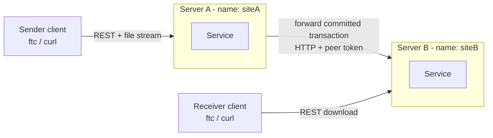
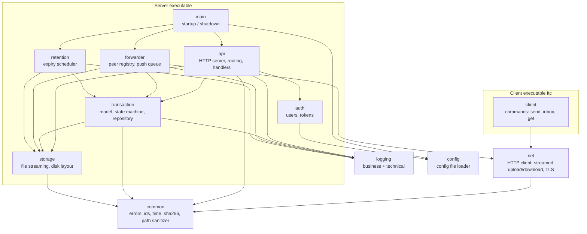
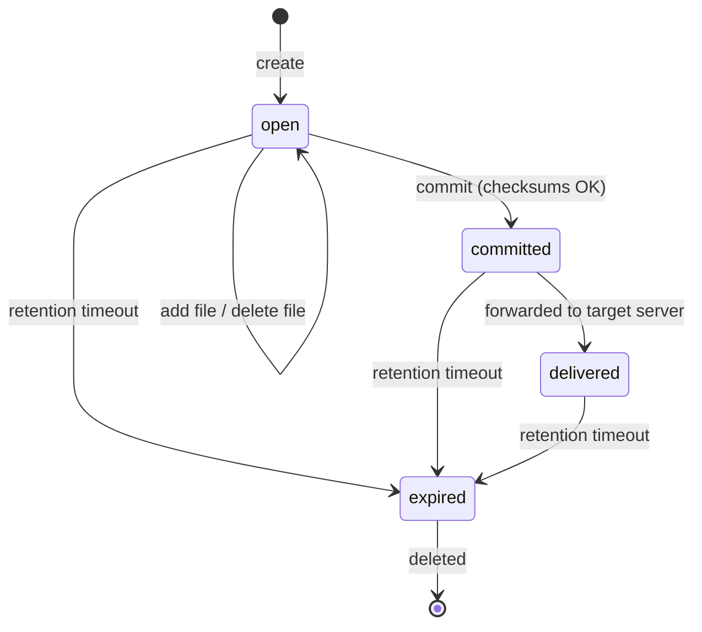
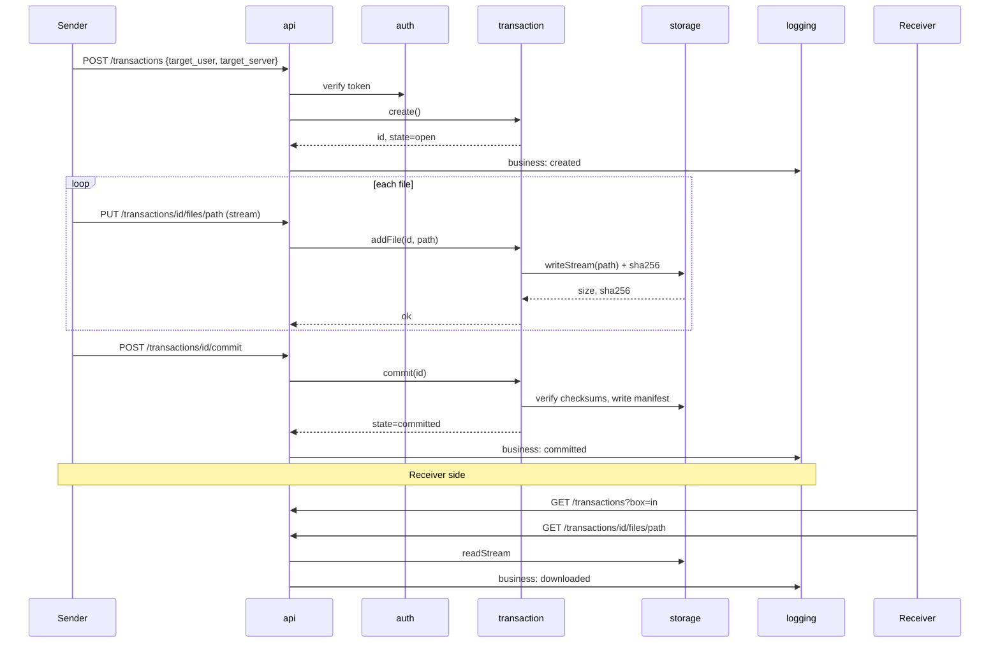
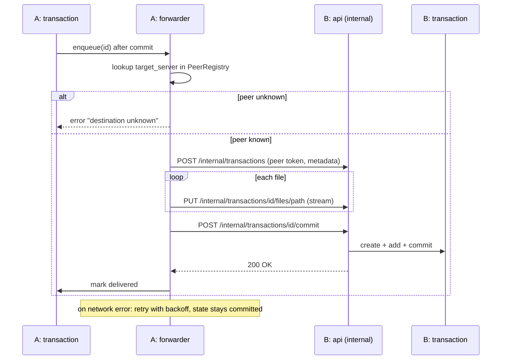
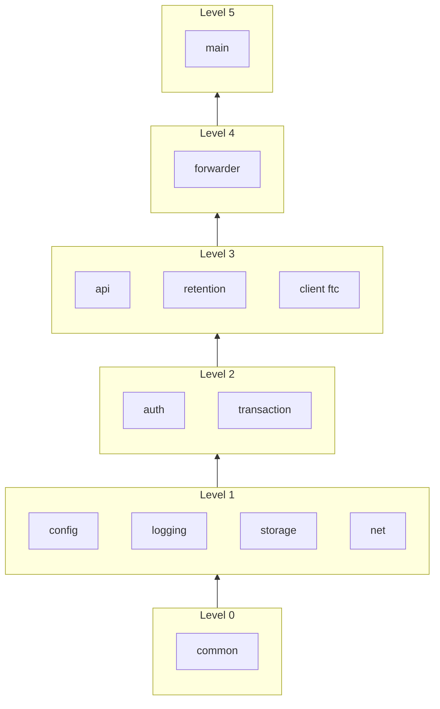

# Architecture: Secure Transaction-Based File Transfer Service

C++23, Boost.Asio/Beast, CMake. Diagrams use Mermaid (render in GitHub, GitLab, or VS Code with a Mermaid preview extension).

## 1. System Overview

Two identical server instances. The sender's server forwards committed transactions to the target server by name (FR-10). Clients use REST only.



## 2. User Workflow

The server never reads a user's disk by itself. The client program (`ftc` or `curl`) sends the files over HTTP, the server stores them in its own transaction folder, and the receiver downloads them the same way. The original files are not touched.

```
Sender machine                 Server (siteA)                    Receiver machine
──────────────                 ──────────────                    ────────────────
1. create transaction  ───────► creates folder, state=open
2. upload file 1..N    ───────► writes to storage, checks sha256
3. commit              ───────► state=committed (locked)
                                  │ (if target is on siteB: forward)
                                  ▼
                               Server (siteB) stores it
                                                       ◄─────── 4. list incoming
                                                       ◄─────── 5. download files
```

### With the `ftc` client

Example: alice sends the folder `~/data/report` to bob on siteB.

```bash
# alice
ftc send --to bob@siteB ~/data/report      # create + upload all files + commit

# bob
ftc inbox                                   # list incoming transactions
ftc get tx-123 ~/downloads                  # download all files, keep folder structure
```

`send` walks the folder with `std::filesystem`, uploads each file with its relative path (`report/a.csv`, `report/img/b.png`), and commits at the end. If one upload fails, the transaction is not committed.

### With plain `curl` (API testing)

```bash
# 1. create the transaction
curl -u alice:secret -X POST http://siteA:8080/transactions \
  -d '{"target_user":"bob","target_server":"siteB","retention_days":30}'
# -> {"id":"tx-123","state":"open"}

# 2. upload each file, keeping its relative path
curl -u alice:secret -X PUT --data-binary @$HOME/data/report/a.csv \
  http://siteA:8080/transactions/tx-123/files/report/a.csv
curl -u alice:secret -X PUT --data-binary @$HOME/data/report/img/b.png \
  http://siteA:8080/transactions/tx-123/files/report/img/b.png

# 3. commit
curl -u alice:secret -X POST http://siteA:8080/transactions/tx-123/commit

# 4. bob: see what has arrived
curl -u bob:secret "http://siteB:8080/transactions?box=in"

# 5. bob: list and download files
curl -u bob:secret http://siteB:8080/transactions/tx-123/files
curl -u bob:secret -o a.csv http://siteB:8080/transactions/tx-123/files/report/a.csv
```

## 3. Modules and Dependencies



Rule: dependencies point downward only. `transaction` and `storage` know nothing about HTTP, so they can be unit-tested without a network. `net` is shared by the server's `forwarder` and the `ftc` client, so the streaming upload/download code is written once.

## 4. What Is Inside Each Module

| Module | Contains | Responsibility | Reqs |
|--------|----------|----------------|------|
| `common` | `Error` / `expected<T,Error>` types, ID generator (UUID), time helpers, `Sha256` streaming hasher, path sanitizer | Shared basics used by server and client. The path sanitizer blocks `../` and absolute paths. | FR-6, NFR-7, NFR-10 |
| `config` | `Config` struct, file parser (JSON or TOML), validation | Loads server name, port, storage dir, users, TLS flag, default retention, peer list. | NFR-8 |
| `logging` | `TechLogger` (levels, rotation), `BusinessLogger` (JSON lines), sinks | Two separate log files. Business events: created, file added/removed, committed, forwarded, downloaded, expired. | FR-8 |
| `auth` | `UserStore` (from config), password hash check, token issue/verify, `Principal` | Who is calling. Peer servers authenticate with a shared peer token. | FR-5, NFR-7 |
| `storage` | `FileStore` (open/write/read/delete streams), atomic rename, disk layout | Writes uploads to `tmp/` in chunks while hashing, then moves the file into the transaction folder. Never holds a whole file in RAM. | FR-6, FR-7, NFR-4, NFR-6 |
| `transaction` | `Transaction`, `FileEntry`, `State` enum, `TransactionService`, `TransactionRepository` (files on disk) | Business rules: only `open` transactions accept changes; commit verifies checksums, writes the manifest, and locks the transaction. Access rules (sender vs target). | FR-1..4, FR-12, FR-13 |
| `api` | `HttpServer` (Asio/Beast, thread pool), `Router`, handlers, JSON (de)serialisation, TLS context | Translates HTTP to service calls and errors to status codes. Streams request and response bodies. | FR-1..4, FR-11, NFR-3 |
| `net` | `HttpClient` (Beast, optional TLS), streamed file upload and download helpers | Client-side HTTP used by both `forwarder` and `ftc`. Reads and writes files in chunks. | FR-7, FR-11, FR-14 |
| `forwarder` | `PeerRegistry` (name to host:port), `PeerClient` (uses `net`), `ForwardQueue` and worker | After commit, pushes the transaction to the peer named in `target_server`, retries on failure, marks it `delivered`. | FR-10, FR-13 |
| `retention` | `RetentionScheduler` (timer thread) | Periodically finds expired transactions and deletes them with their files. | FR-9 |
| `client` | `ftc` executable: `send`, `inbox`, `get` commands, folder walker (`std::filesystem`), progress output | User-facing tool. `send` walks a folder, uploads each file with its relative path and commits; `get` downloads a transaction and recreates the folders. | FR-14 |
| `main` | `main.cpp` (server) | Parses the CLI, loads config, wires all modules, handles SIGINT/SIGTERM for clean shutdown. | NFR-8 |
| `tests` | Unit and integration tests | State machine, checksum, path sanitizer, retention, full flow on one and two local instances. | NFR-9 |

## 5. Transaction State Machine



`committed` and `delivered` are immutable: add/delete returns `409 Conflict`. For a transaction whose target user is on the same server, `committed` is already downloadable. The `delivered` state applies only to forwarded transactions.

## 6. Main Flow: Upload, Commit, Download



## 7. Forwarding Flow (Server A to Server B)



## 8. REST API (draft)

| Method | Path | Purpose |
|--------|------|---------|
| POST | `/transactions` | Create (body: `target_user`, `target_server`, `retention_days`) |
| GET | `/transactions?box=in\|out` | List my incoming or outgoing transactions |
| GET | `/transactions/{id}` | Details and state |
| PUT | `/transactions/{id}/files/{path}` | Upload a file (streamed body, header `X-Checksum-SHA256`) |
| DELETE | `/transactions/{id}/files/{path}` | Remove a file (open only) |
| POST | `/transactions/{id}/commit` | Make immutable |
| GET | `/transactions/{id}/files` | List files with sizes and checksums |
| GET | `/transactions/{id}/files/{path}` | Download a file (streamed) |
| POST/PUT | `/internal/transactions/...` | Server-to-server push (peer token only) |

## 9. On-Disk Layout

```
<storage_dir>/
├── tmp/                          # uploads in progress (deleted on restart)
└── transactions/
    └── <transaction-id>/
        ├── meta.json             # sender, target user/server, state, created, retention
        ├── manifest.json         # after commit: file list, sizes, sha256
        └── files/
            └── <relative/path>   # payload
<log_dir>/
├── technical.log
└── business.log
```

Metadata is plain JSON on disk (no database) to keep dependencies minimal. Files are moved from `tmp/` with an atomic rename, so an interrupted upload never leaves a partial file in a transaction (NFR-6).

## 10. Threading Model

- Boost.Asio `io_context` with a fixed thread pool (e.g. number of cores). Each request runs on one pool thread; large bodies are read and written in chunks (e.g. 1 MB).
- One lock per transaction (in `TransactionService`) protects the state machine. Different transactions never block each other.
- `forwarder` and `retention` run on their own worker threads and use the same services.
- Loggers are thread-safe (mutex or queue with a writer thread).

## 11. Source Tree


```
project/
├── CMakeLists.txt
├── config/server.example.json
├── src/
│   ├── app/         (main.cpp)
│   └── lib/
│       ├── common/      (error.hpp, id.hpp, time.hpp, path_sanitizer.hpp/.cpp)
│       ├── config/      (config.hpp/.cpp)
│       ├── logging/     (tech_logger, business_logger)
│       ├── auth/        (user_store, token_service)
│       ├── storage/     (file_store, sha256)
│       ├── transaction/ (transaction.hpp, transaction_service, repository)
│       ├── api/         (http_server, router, handlers, json)
│       ├── forwarder/   (peer_registry, peer_client, forward_queue)
│       └── retention/   (retention_scheduler)
└── tests/           (unit/, integration/)
```

## 12. Module Development Order (by dependency)

A module can be started once everything it depends on is ready. Modules on the same level do not depend on each other, so they can be built in any order or in parallel. Most modules also use `common` (errors, ids), even where the diagram in section 3 does not draw that arrow.



| Order | Module | Depends on | Needed by | Notes |
|-------|--------|------------|-----------|-------|
| 1 | `common` | — | everything | `Error` / `expected` first (other modules return it), then ids, time, path sanitizer, `Sha256`. |
| 2a | `config` | `common` | `auth`, `main` | Loads everything else's settings; start with the fields you need now and add later. |
| 2b | `logging` | `common` | `transaction`, `api`, `forwarder`, `retention` | Technical logger first, business logger before `transaction`. |
| 2c | `storage` | `common` | `transaction`, `api`, `forwarder`, `retention` | Streamed write to `tmp/` with hashing, atomic rename, streamed read. Unit-testable alone. |
| 2d | `net` | `common` | `client`, `forwarder` | Not needed until level 3; can be postponed until `api` exists, so it can be tested against a real server. |
| 3a | `auth` | `config`, `common` | `api` | User store from config, password check, peer token. |
| 3b | `transaction` | `storage`, `logging`, `common` | `api`, `forwarder`, `retention` | Inside the module: model and `State` → state machine → repository (`meta.json`, `manifest.json`) → `TransactionService` (locks, access rules). The core of the project. |
| 4a | `api` | `auth`, `transaction`, `storage`, `logging`, `common` | `main` (and peer servers via `/internal`) | First point where the full flow can be tested with `curl`. |
| 4b | `retention` | `transaction`, `storage`, `logging` | `main` | Small; only needs `TransactionService` to list and delete expired transactions. |
| 4c | `client` (`ftc`) | `net` | — | Separate executable; testable once `api` is running. |
| 5 | `forwarder` | `transaction`, `storage`, `net`, `logging` | `main` | Needs `net`, and for end-to-end tests the `/internal` endpoints of `api` on the peer. |
| 6 | `main` | `config`, `api`, `forwarder`, `retention` | — | Only wiring and signal handling. A minimal version (config + api) can exist from level 4 on and grow as modules are added. |

Critical path: `common` → `storage` → `transaction` → `api` → `forwarder` → `main`. Delays in these modules delay the whole project; `config`, `logging`, `auth`, `retention` and `client` are off the critical path and can be done alongside.

## 13. Suggested Build Order (about 2 weeks of evenings)

| Stage | Modules | Result |
|-------|---------|--------|
| 1 | `common`, `config`, `logging`, CMake, test setup | Skeleton builds, config loads, logs written |
| 2 | `storage`, `transaction` | State machine and streamed files work in unit tests, no HTTP yet |
| 3 | `api`, `auth` | Full flow works with `curl` on one server |
| 4 | `net`, `client` (`ftc`), `retention`, large-file and small-batch checks | `ftc send` / `inbox` / `get` work with a folder; cleanup works; 10 GB test passes with stable memory |
| 5 | `forwarder` (reuses `net`) and TLS (should) | Two local instances exchange a transaction |
| 6 | Tests, README, benchmark, sanitizers | Definition of Done reached |

